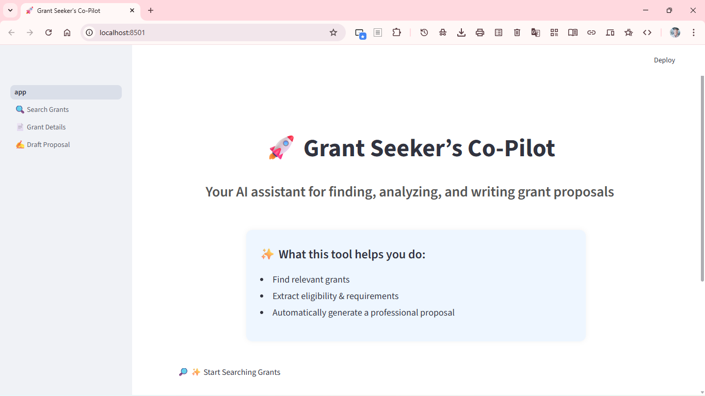
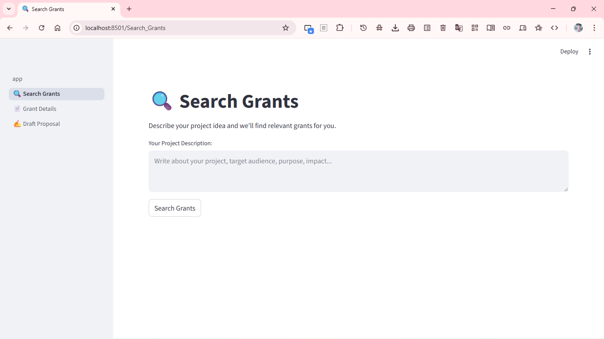
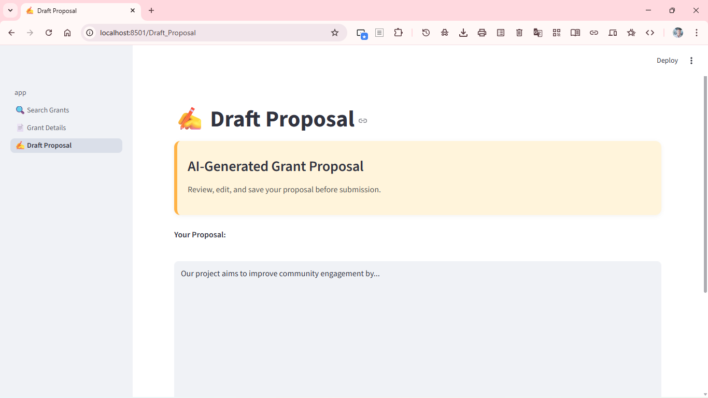

# 🚀 GrantAI Co-Pilot
> **AI-powered multi-agent assistant that finds grants, analyzes eligibility, and writes proposals — automatically.**

Small nonprofits and community innovators often struggle with grants because of:
- Complex eligibility rules  
- Long PDF guidelines  
- Time-consuming proposal writing  
- Lack of funding expertise  

💡 **GrantAI Co-Pilot solves this by acting as an AI teammate.**  
It searches funding opportunities, extracts requirements, and generates professional proposals tailored to the grant.

---

## 🧠 How It Works (Multi-Agent System)

| AI Agent | Role | Function |
|----------|------|----------|
| 🕵️‍♂️ **Scout Agent** | Researcher | Searches and recommends relevant grants |
| 🧾 **Analyst Agent** | Compliance Expert | Extracts eligibility, deadlines & requirements |
| ✍️ **Writer Agent** | Proposal Author | Generates a grant-ready proposal using project inputs |

> Together, they automate the entire grant lifecycle — from discovery to documentation.

---

## 🏗 System Architecture
{
User (Frontend Input)
|
▼
Streamlit UI <──► Backend Orchestrator (planned)
|
|
├── 🕵️ Scout Agent (Grant Search API)
├── 🧾 Analyst Agent (Web/PDF Extractor)
└── ✍️ Writer Agent (LLM Proposal Generator)
|
▼
Proposal Display + Download (Frontend)
}

---

## 💻 Tech Stack

| Layer | Technology |
|-------|------------|
| **Frontend (Live UI)** | Streamlit (Python 3.x Latest) |
| **Backend (Planned)** | FastAPI + Gemini / OpenAI API |
| **Deployment (Planned)** | Cloud Run / Dockerized |
| **Data (Current)** | JSON grant samples |

---

## 📸 Screenshots (UI Preview)

### 🏠 Home Page  


### 🔎 Grant Search Results  


### ✍️ Proposal Generator  


> 📌 Place actual screenshots in a folder named:

screenshots/
├─ home_page.png
├─ search_results.png
└─ proposal_page.png

---

## ⚙️ Installation & Run

```bash
# Clone the repo
git clone https://github.com/Ujjwal-Ruhal/grantai-copilot.git
cd grantai-copilot

# Create virtual environment
python -m venv venv

# Activate:
# Windows
venv\Scripts\activate
# Mac / Linux
source venv/bin/activate

# Install dependencies
pip install -r requirements.txt

# Launch the application
streamlit run app.py


---


---

## 🚀 Features (Current + Upcoming)

✔ **Current (Frontend MVP)**
- 🌐 Grant search UI
- 📌 Grant eligibility viewer
- ✍️ Proposal generator interface
- 📄 Download & copy proposal

🔜 **Next (Backend & AI)**
- 🤖 Real grant search (Scout Agent API)
- 🧠 Eligibility extraction from PDFs (Analyst Agent)
- ✨ Custom proposal writer via LLM (Writer Agent)
- 🏆 Smart ranking for best grant matches

---

## 🧑‍💻 Team & Responsibilities

- ### 🔵 **Ujjwal Ruhal — Lead Frontend & UI Developer**
- Designed complete Streamlit interface  
- Built reusable UI components  
- Handled proposal UX & interactivity  
- Prepared polished demo UI for judges  
- 🔗 **LinkedIn:** [linkedin.com/in/ujjwal-ruhal](https://www.linkedin.com/in/ujjwal-ruhal-55ba52187/)

- 🟣 **Shek Lun** — Technical Lead & Backend Developer  
  - Architected multi-agent system  
  - Led deployment & API orchestration

- 🟠 **Nakazzi Kiyaga-Mulindwa** — Project & Presentation Lead  
  - Documentation, pitch, & submission strategy  
  - UAT & quality control

- 🟢 **Hemanth Reganti** — Chief Architect & Strategic Advisor  
  - System overview & scalability guidance  
  - Technical quality review

---

## 🛡 Ethical & Accessibility Notes

- Promotes equality in funding access
- Supports small organizations without financial barriers
- Will include multilingual support in future
- No discriminatory filtering in grant ranking

---

## 🌱 Future Vision

GrantAI Co-Pilot aims to become:
- A universal funding assistant used by nonprofits worldwide.

**Planned roadmap:**
- 🌍 Multi-language proposal output
- 📑 Extract data from scanned PDFs
- 💰 Funding success probability scoring
- 🤝 NGO collaboration dashboard
